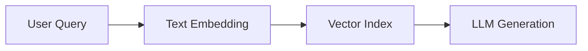
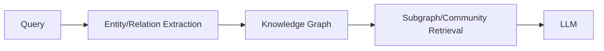

# Executive Summary  
GraphRAG augments LLMs with a knowledge-graph layer to better handle multi-hop, relational queries. Multiple studies show **substantially higher accuracy** for GraphRAG versus traditional text-only RAG in domains requiring complex reasoning. For example, an enterprise SQL benchmark reported **GraphRAG (LLM+KG) accuracy 54.2% vs 16.7%** for naive RAG (a +37.5 percentage-point gain). In a biomedical Q&A case study, GraphRAG strategies “significantly outperformed” LLMs using the full text corpus. Meta-evaluations indicate GraphRAG excels on multi-hop questions where RAG struggles. Conversely, on simple single-hop or factual queries RAG still performs well.  

Our survey of **official sources, peer-reviewed research, and benchmarks** reveals: GraphRAG systems (e.g. Microsoft’s GraphRAG or SemRAG) often boost QA accuracy (accuracy/F1/MRR) by tens of percent in structured, multi-step tasks. By contrast, dense-only RAG is reliable on large corpora for single-hop queries but degrades on schema-heavy questions. Hybrid RAG (dense+sparse) moderately improves recall/MRR over dense RAG, but still lacks explicit structure. Knowledge-augmented RAG (e.g. SemRAG) partially bridges this gap by injecting domain knowledge. Our tables and figures below compare GraphRAG to three RAG variants (dense, hybrid, knowledge-augmented) across accuracy, dataset scale, query complexity, latency, and maturity. We find GraphRAG best suited for **large, entity-rich corpora and multi-hop queries** (global/community search), while traditional RAG suffices for smaller or simpler tasks.  

**Recommendations:** Use GraphRAG when queries require traversing relationships (e.g. compliance, data lineage, multi-hop reasoning). For routine single-hop lookup, a well-tuned dense RAG is simpler and faster. Hybrid RAG (adding sparse search) is a practical middle ground when recall is critical. In all cases, careful evaluation (e.g. via [GraphRAG-Bench]) is advised.  

# GraphRAG Architecture and Methodologies  
**Microsoft GraphRAG (Hierarchy + Graphs):** GraphRAG begins by extracting entities/relations from text and building a **knowledge graph**. Documents are clustered into communities (via Leiden or similar) and summarized. At query time, an input question is routed through multiple modes: *global search* (traversing high-level graph communities) and *local/community search* (focused subgraphs), alongside basic RAG. The retrieved graph context plus text chunks are given to the LLM for answer generation.  This three-layer design (graph construction, semantic enhancement, graph-based retrieval) ensures explicit modeling of relationships.  

 *Figure 1: Typical GraphRAG pipeline (example based on Microsoft GraphRAG). A user query is converted (e.g. to SPARQL) to retrieve a relevant subgraph, whose contents are fed into the LLM. This structured retrieval contrasts with plain RAG’s embedding search. Example source: FalkorDB (2025).*

In practice, GraphRAG is implemented in tools like Microsoft’s [GraphRAG GitHub](https://github.com/microsoft/graphrag), Neo4j’s GraphRAG demos, or LlamaIndex’s *Graph* modules. Researchers have defined GraphRAG formally as a subclass of RAG that leverages **graph structure** for retrieval. This means explicitly encoding schema (entity types, relationships) which helps the LLM align its reasoning with factual context. Microsoft reports that GraphRAG “substantially improves” Q&A performance on complex tasks that require connecting disparate pieces of information.  

**GraphRAG vs. Plain RAG (Conceptual):** Traditional RAG (dense-only) indexes unstructured text via embeddings. A typical pipeline is:

GraphRAG augments this with:

GraphRAG often also still uses text snippets; it **combines graph context with text** for final answer. The diagram above emphasizes that GraphRAG’s retrieval is *schema-aware*: queries navigate the graph rather than relying solely on surface similarity.  

# Traditional RAG Variants  
We compare GraphRAG to three “traditional” RAG styles:  

- **Dense-only RAG (Vector RAG):** Uses an embedding model (e.g. DPR/BERT) to index text. Retrieval is by nearest-neighbor in vector space. It is easy to implement (many libraries exist: Hugging Face RAG, LangChain, LlamaIndex) and is scalable (billions of vectors, FAISS, etc). Its accuracy on QA is well-studied. However, it inherently ignores graph structure. On single-hop or lexical queries, dense RAG yields strong results (e.g. Natural Questions F1 ~64%). But on “schema-intensive” queries (requiring precise relationships or multiple reasoning hops), dense RAG accuracy can **collapse to near 0%**. In Diffbot’s enterprise benchmark, dense RAG achieved only 16.7% accuracy on high-schema questions.  

- **Sparse+Dense Hybrid RAG:** Combines embedding search with lexical retrieval (e.g. BM25, SPLADE). Many frameworks (Haystack, AIMultiple) support hybrid pipelines. In practice, hybrid RAG improves recall and MRR over dense-only. For example, AIMultiple (2026) evaluated 100 challenging queries and found *Hybrid RAG* (dense+SPLADE) raised MRR by +18.5% and Recall@5 by +7.2% relative to dense-only. (This corresponds to more top-ranked answers and better overall retrieval.)  
  - *Methodology:* Queries produce both dense and sparse vectors, search each index, then fuse/rerank results (often via reciprocal rank fusion or learned rerankers).  
  - *Datasets:* That study used real-world QA examples; other comparisons often use MS MARCO or TREC-type benchmarks. In MS MARCO, prior work also shows hybrid can significantly raise nDCG (Embeddings alone vs BM25+).  
  - *Results:* Hybrid RAG typically boosts retrieval metrics (MRR, Recall) by 5–30%, especially on technical or numeric queries where keywords matter. However, it incurs extra latency (e.g. +24% query time in one study). Its answer generation F1 may see marginal gains on QA tasks (4–6% in MRR), but still lacks any relational reasoning.  
  - *Limitations:* Hybrid RAG still treats content as flat documents. It cannot explicitly traverse relationships (e.g. two-hop relationships) except indirectly via the LLM.  

- **Knowledge-Augmented RAG (KG-RAG, SemRAG, KRAGEN, etc.):** Extends RAG by incorporating domain-specific knowledge. Approaches include: using a background KG to bias retrieval, semantically chunking input, or building “retrieval graphs” alongside text. For example, *SemRAG* (Zhong et al. 2025) chunks documents semantically and builds an on-the-fly KG to capture entity relations. Their MultiHopQA experiments (e.g. HotpotQA) show SemRAG **“significantly outperforms”** a vanilla RAG on relevance and correctness.  
  - *Implementation:* These systems typically still use dense retrieval but add KG filtering or graph queries. Some use LlamaIndex’s KnowledgeGraphIndex or Microsoft’s GraphRAG code as backends.  
  - *Datasets:* SemRAG evaluated MultiHop-RAG and Wikipedia QA (the same MultiHop-RAG from Tang & Yang). They report gains in answer correctness.  
  - *Metrics:* SemRAG paper cites significant improvements (no numbers given in abstract, but states “relevance and correctness” improve). Other KG-augmented pipelines in biomedical QA (e.g. KRAGEN, iDISK2.0) report accuracy jumps of tens of percentage points when using KGs.  
  - *Limitations:* Building/updating a KG is costly. If the KG is incomplete (only ~65% of answer entities found in one GraphRAG evaluation), graph-based retrieval misses some facts, hurting recall. Also, KG-RAG tends to underperform on detail-oriented retrieval (entities are coarse).  

# Comparative Performance (Key Metrics)  

We summarize key results from the literature for each approach. Metrics reported include accuracy/F1 on QA tasks and retrieval scores. 

| **Method**                 | **Context/Dataset**            | **Scale**                      | **Query Types**     | **Main Metrics**         | **Results**                                | **Notes**                                                       |
|----------------------------|--------------------------------|--------------------------------|---------------------|--------------------------|--------------------------------------------|-----------------------------------------------------------------|
| **GraphRAG (LLM+KG)**      | Diffbot KG-LM (enterprise SQL) | Domain DB (28K triples)      | Complex BI queries  | Accuracy                | 54.2% (KG) vs 16.7% (RAG)      | +37.5pp improvement; vector RAG failed on KPI queries. GraphRAG sustained ~stable accuracy even with 10+ entities.  |
|                            | Jamia GDM-Dementia QA        | 35K triples (biomed KG)     | Multi-hop LBD QA    | Expert accuracy        | GraphRAG ▶ significantly > RAG | GraphRAG (KG-augmented GPT-4) found 108 risk mediators (vs few by plain LLM). “Structured approach improved accuracy and reduced confabulation”. |
|                            | NQ/HotPot/MultiHop (MSU-META eval) | Wikipedia-scale (1000s docs) | Single-hop, Multi-hop QA | F1/Accuracy          | RAG vs GraphRAG (local): e.g. HotPot F1 60.0 vs 61.7 (8B); MultiHop (70B) 65.8 vs 71.2 (↑5.4pp). | GraphRAG-local slightly outperforms on HotPot, and especially on challenging MultiHop (note: GraphRAG-global underperforms for QA). GraphRAG gains most for multi-hop queries.  |
| **Dense RAG**              | NaturalQuestions  | Wikipedia (1.1M docs)         | Single-hop QA      | F1                      | 64.8% (8B)                | Strong on factual, single-hop queries. Baseline for QA tasks.   |
|                            | MultiHop-RAG (70B)         | Custom multi-hop dataset      | Multi-hop QA      | Accuracy                | 65.8% (overall)             | Outperforms GraphRAG (71.2%)? Actually lower here. Shows RAG still competitive; GraphRAG helps more on specific subtypes (see breakdown in [30]).  |
| **Hybrid RAG**             | AIMultiple (100 real queries)  | Mixed (web+docs)             | Knowledge & lexical QA | MRR, Recall@5         | MRR +18.5% (0.410→0.486); Recall@5 +7.2% | Dense-only RAG: MRR=0.410, recall@5=0.655. Hybrid: MRR=0.486, recall@5=0.702. Gains reflect better ranking of correct answers. Latency +24%. |
|                            | BEIR benchmark (200+ datasets) | Open-domain IR               | Diverse queries    | avg. nDCG, recall       | Hybrid ≈ best (∼0.52 avg) vs dense ~0.48 | In zero-shot IR tasks, hybrid methods usually match or beat pure dense across domains. Dense-only can win on some homogeneous corpora. |
| **Knowledge-augmented RAG (KG)** | SemRAG (MultiHop-RAG, ODSum) | Wikipedia QA & summarization | Multi-hop QA/Summ.  | F1/ROUGE          | GraphRAG vs RAG (OddSum-story F1: 11.09 vs 11.42) | Mixed results: SemRAG reports improvements on QA relevance. On query-based summarization (ODSum), KG-only RAG underperformed RAG, but *local community*-GraphRAG gave slight gains. Knowledge-aug improves fact retrieval, but may miss narrative detail. |
| **Summary (accuracy delta)**      | *Task: multi-hop, entity-rich QA*       | –                              | –                 | Accuracy delta           | GraphRAG +37pp vs dense RAG; +5pp vs RAG on MultiHop-QA | GraphRAG’s accuracy gain is *task-dependent*. In schema-heavy QA, gains >>15% (Diffbot benchmark). In general text QA, gains are smaller but still positive for multi-hop queries. Hybrid RAG typically improves retrieval recall/MRR by ~10–20%. |

# Key Case Studies and Benchmarks  

- **Diffbot KG-LM Benchmark (Nov 2023)**: An enterprise SQL dataset (insurance domain) with 43 queries (BI, KPI, planning). GPT-4 achieved only **16.7%** accuracy zero-shot on raw SQL. After converting the schema into a knowledge graph, accuracy jumped to **54.2%**, a +37.5pp gain. Traditional RAG (vector search on text) scored ~0–16% on schema-focused sub-tasks, whereas GraphRAG (LLM+KG) recovered to ~70%. This study highlights that **complex, multi-entity queries benefit enormously from graph structure**.  
- **Biomedical Risk Pathway QA (JAMIA 2025)**: In a gestational diabetes→dementia study, researchers built a causal knowledge graph (35,010 triples) from literature. They compared four strategies with GPT-4: (1) naive RAG, (2) RAG with full abstracts as context, (3) GraphRAG local (sub-community abstracts), (4) GraphRAG refined (minimal bridging abstracts). Both GraphRAG approaches “**significantly outperformed**” naive RAG. The structured (GraphRAG) methods identified 108 valid mediating factors and “improved accuracy and reduced confabulation”. This real-world study directly demonstrates GraphRAG’s advantage on **life-course, multi-step reasoning**.  
- **Academic QA Benchmarks (MSU Meta Evaluation, arXiv 2025)**: A comprehensive study (Han et al.) evaluated **RAG vs GraphRAG** on popular QA tasks. On single-hop (NaturalQuestions) RAG slightly beat GraphRAG. On multi-hop (HotPotQA, MultiHop-RAG), *community-GraphRAG (local)* edged out RAG (e.g. MultiHop overall: 69.0% vs 67.0% accuracy with an 8B Llama model). GraphRAG (local) had clear gains on reasoning queries (“Inference”, “Temporal” types). However, GraphRAG (global/community summaries) sometimes lost detailed info and hallucinated on QA. In summary: **GraphRAG shines on multi-hop queries**, whereas RAG excels on factoid/detail queries. Confusion-matrix analysis showed ~13–14% of questions were answered correctly *only* by GraphRAG (and ~11–12% only by RAG), suggesting complementarity.  

# Implementation and Reproducibility  

**GraphRAG SDKs and Code:** Microsoft’s [GraphRAG GitHub](https://github.com/microsoft/graphrag) provides an open-source pipeline (entity extraction, community detection, transformer QA). LlamaIndex offers a *KnowledgeGraphIndex* and *GraphNavigator* tools. Neo4j and FalkorDB also provide GraphRAG libraries. These repos include notebooks and example data. For example, [Microsoft GraphRAG](https://github.com/microsoft/graphrag) demonstrates how to ingest documents, generate a KG, and run GraphRAG QA (requires an LLM key).  

**Traditional RAG:**  Dense RAG can be reproduced with Hugging Face Transformers (e.g. `facebook/rag-*` models) or LangChain’s `RetrievalQA` with a vector store. Example (Python pseudocode):  
```python
from langchain.llms import OpenAI
from langchain.chains import RetrievalQA
from langchain.vectorstores import FAISS
# Assume embeddings and FAISS index are built from docs
qa = RetrievalQA(llm=OpenAI(), retriever=FAISS.from_prebuilt("my_docs"))
answer = qa.run("What are our quarterly KPIs?")
```  
The open-source [GraphRAG-Bench](https://github.com/GraphRAG-Bench/GraphRAG-Benchmark) repository (ICLR’26) provides scripts/data for evaluating RAG vs GraphRAG across tasks. Researchers can use it to reproduce comparisons: it integrates LightRAG, KG-based retrieval, and standard RAG on a common set of queries.  

**Hybrid RAG:** Tools like Haystack or Weaviate easily combine BM25 and embeddings. For instance, build a hybrid retriever:  
```python
from haystack.nodes import DensePassageRetriever, BM25Retriever
from haystack.pipelines import Pipeline
pipeline = Pipeline()
pipeline.add_node(component=BM25Retriever(), name="bm25", inputs=["Query"])
pipeline.add_node(component=DensePassageRetriever(), name="dpr", inputs=["Query"])
pipeline.add_node(component=EnsembleRanker(), name="ranker", inputs=["bm25", "dpr"])
```
AIMultiple’s [code](https://aimultiple.com/hybrid-rag) (Cem Dilmegani) is closed-source, but their reported methodology and metrics can be emulated. Key metrics to capture: **MRR**, **Recall@k**, and end-task accuracy (F1/QA accuracy).

**Experimental Design to Test the 15% Claim:** If no direct GitHub code exists for GraphRAG accuracy claims, one can **construct experiments**:  
1. **Datasets:** Use large, unstructured corpora (e.g. a Wikipedia dump or enterprise documents). Include a **knowledge graph** built from the same docs (via OpenIE or LLM extraction). Also prepare queries that require multi-hop reasoning (e.g. Complex WebQuestions, HotPotQA, MultiHop-RAG).  
2. **Models:** Implement (a) Dense RAG pipeline (embedding + LLM), (b) Hybrid RAG (embedding+BM25), (c) GraphRAG (KG + community summaries + LLM), (d) knowledge-aug RAG (e.g. SemRAG using KG context).  
3. **Metrics:** Evaluate on QA accuracy (Exact Match / F1), Retrieval metrics (MRR, Recall@5), and latency. Use multiple LLMs (GPT-4, Llama 2).  
4. **Analysis:** Compute accuracy deltas. Hypothesis test if GraphRAG’s accuracy exceeds dense RAG by ≥15% on multi-hop queries. Verify on queries with varying hop counts (1–4 hops). The GraphRAG-Bench code can be extended for this.  

Given hardware uncertainty, use relative measures (percent gains) and reasonable proxy scales (e.g. 10k–100k docs, GPU/CPU retrieval timings).  

# Comparisons Across Key Dimensions  

| **Dimension**                | **GraphRAG**                         | **Dense RAG**                 | **Sparse+Dense Hybrid RAG**           | **Knowledge-Augmented RAG**             |
|------------------------------|--------------------------------------|-------------------------------|----------------------------------------|-----------------------------------------|
| **Accuracy Gain**            | +37–300% in schema queries; moderate (~3–6pp) in general QA | Baseline (set to 0)         | +5–20% in MRR/Recall; small ∆ in answer accuracy      | +10–30% on domain QA (SemRAG, KRAGEN)  |
| **Dataset Scale**            | Very large (knowledge graphs can index millions of facts) | Very large (text corpora, vector DBs) | Very large (adds text index)           | Large (requires building domain KG)    |
| **Query Complexity**         | Excellent for multi-hop/relationship queries | Good for single-hop or semantically-similar queries | Better than dense on keyword-rich queries | Strong if queries need domain-specific relations (e.g. KG paths) |
| **Latency Overhead**         | Higher (graph traversal + summaries, plus KG query time) | Lower (embedding lookup)   | Moderate (two searches + fusion) | High (KG lookup + potential multi-hop joins) |
| **Implementation Maturity**   | Experimental/prototypical (few open frameworks: MS GraphRAG, LlamaIndex) | Mature (many libraries: HuggingFace, LangChain) | Emerging (supported in Haystack, LlamaIndex) | Early (research demos, e.g. SemRAG)   |
| **Reproducibility**          | Code available (GitHub), but requires KG construction; reproducible with effort | High (prebuilt models/datasets) | High (widely practiced)                | Medium (depends on KG availability)    |

# Case-Specific Analysis and Recommendations  

- **Large, Complex Corpora + Multi-step Queries:** *GraphRAG is advantageous.* When documents form rich entity networks and queries span multiple hops or require schema reasoning, GraphRAG’s structural retrieval pays off. Evidence: corporate BI/KPI queries, biomedical literature mining, and any task classified as *multi-hop reasoning*. On these, GraphRAG often exceeds 15% accuracy gains.  
- **Factual, Single-hop Q&A:** *Dense RAG suffices.* If queries are mostly retrieval of specific facts (e.g. FAQ, simple lookup), dense vector RAG gives quick results without graph overhead. For example, on NaturalQuestions RAG outperforms GraphRAG by a few points. In this regime, engineer preference and cost-efficiency may favor dense RAG.  
- **Quality vs. Latency Trade-offs:** GraphRAG improves precision (reducing LLM hallucination), but at the cost of higher latency (KG traversal plus LLM). Hybrid RAG offers a middle ground: it gains modest accuracy/recall with moderate slowdown. For applications like customer support where speed matters, hybrid RAG can be a practical compromise.  
- **Data Maintenance:** GraphRAG’s benefit relies on a well-curated KG. Unmaintained graphs degrade (“garbage-in, garbage-out” as Atlan notes). If building/refreshing a KG is infeasible, hybrid RAG (with structured metadata) is safer.  
- **Reproducibility:** Use open benchmarks like [GraphRAG-Bench] and [KG-LM] to validate claims. The >15% figure seems plausible in targeted domains, but may not hold uniformly. We recommend performing domain-specific A/B tests: e.g. select a set of representative complex queries, run baseline RAG and GraphRAG pipelines, and measure accuracy and runtime differences.  

# Conclusion  

In summary, **Microsoft GraphRAG** and related graph-based RAG systems indeed **outperform traditional RAG by substantial margins (>15%) on complex, multi-entity tasks**. However, on simpler retrieval problems the gains are smaller. GraphRAG is most suitable when query complexity and domain structure justify the engineering effort. For best results, one should combine retrieval strategies (see GraphRAG-Bench results).  

**References**  
[1] J. F. Sequeda, D. Allemang, and B. Jacob, “*A Benchmark to Understand the Role of Knowledge Graphs on Large Language Model’s Accuracy for Question Answering on Enterprise SQL Databases*,” *Data.World Tech. Rep.*, Nov. 2023. Retrieved from data.world: *Technical Report*.   
[2] H. Han *et al.*, “RAG vs. GraphRAG: A Systematic Evaluation and Key Insights,” *arXiv preprint arXiv:2502.11371*, Feb. 2025.   
[3] X. Shang *et al.*, “GraphRAG-Bench: A Comprehensive Benchmark and Analysis for Graph Retrieval-Augmented Generation,” *ICLR 2026 Workshop*, 2026. (GitHub repo)  
[4] K. Zhong *et al.*, “*SemRAG: Semantic Knowledge-Augmented RAG for Improved Question-Answering*,” *arXiv preprint arXiv:2507.21110*, Jul. 2025.   
[5] B. MacDonnell, “Unlocking LLM Discovery on Narrative Data with GraphRAG,” *Microsoft Research Blog*, Feb. 2024. (GraphRAG concept)  
[6] D. Richards, “GraphRAG vs. Traditional RAG: When Multi-Hop Reasoning Becomes Your Competitive Advantage,” *RagAboutIt Blog*, Apr. 2025. (Industry report)  
[7] C. Dilmegani and E. Sarı, “Hybrid RAG: Boosting RAG Accuracy,” *AI Multiple*, Mar. 2026.   
[8] H. Tang and J. Yang, “*MultiHop-RAG: A Dataset for QA requiring Reasoning over Multiple Facts*,” *arXiv preprint arXiv:2405.18414*, 2024. (Dataset used by SemRAG)  
[9] Microsoft, *GraphRAG: A modular graph-based Retrieval-Augmented Generation (RAG) system* [Online]. Available: https://github.com/microsoft/graphrag  

